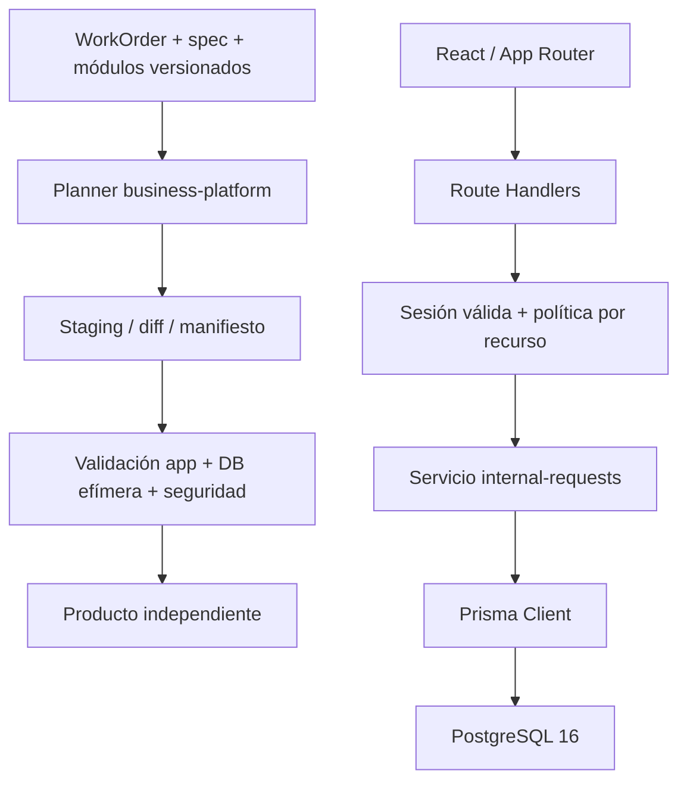

# P4.1 — Business Platform: requisitos, alcance y arquitectura propuestos

2026-09-15 · Propuesta 0.1.0 para revisión humana. **Solo P4.1 autorizada.** P3 aprobado como PASS_WITH_LIMITATIONS; corporate-site 0.1.0 permanece validated pilot capability de uso interno/controlado. Este documento no autoriza implementar P4.2 ni instalar herramientas. Todas las reglas de negocio siguientes son propuestas, no requisitos definitivos del cliente.

## 1. Definición y MVP recomendado

business-platform es una capacidad de generación de aplicaciones empresariales independientes con persistencia, identidad de usuarios, autorización en servidor y al menos un flujo de dominio con consumidor explícito. No es corporate-site con un formulario conectado a una BD ni un ERP configurable sin límites.

| Dimensión | corporate-site P3 preservado | business-platform MVP propuesto |
|---|---|---|
| Información | Contenido público/configurado | Datos privados persistentes y contenido de aplicación |
| Interacción | Local, demostrativa, memoria | Operaciones validadas y transaccionales |
| Identidad | Sin cuentas | Usuarios/sesiones Better Auth |
| Permisos | No hay dominio privado | Política fija por rol y propietario |
| Persistencia | Ninguna | PostgreSQL 16 + Prisma 7 |
| Frontera servidor | Página y demos locales | Route Handlers + servicios de dominio |
| Entrega | Proyecto autónomo sin BD | Proyecto autónomo app + BD, migraciones y herramientas locales |

No todo producto empresarial futuro tiene que usar exactamente este perfil; **para P4 se propone un perfil obligatorio auth+DB+un módulo**, sin soportar todas las combinaciones opcionales. No hay SaaS multitenant: una instancia/producto pertenece a una sola organización ficticia. Los límites entre dos productos se prueban con redes/volúmenes/credenciales independientes.

### Opciones del módulo piloto

| Opción | Consumidor propuesto | Qué demuestra | Coste/riesgo | Clasificación para el MVP |
|---|---|---|---|---|
| Solicitudes internas | Equipo ficticio que registra y revisa solicitudes de trabajo | CRUD equivalente, propietario, estados, permisos horizontales, persistencia | Bajo; excluir SLA, adjuntos y notificaciones | **Recomendada**, pendiente de confirmar consumidor |
| Directorio de clientes | Equipo ficticio que mantiene fichas comerciales | CRUD, búsqueda, validación y roles | Medio; datos personales, duplicados y acceso por propietario menos natural | Alternativa si existe necesidad inmediata de fichas |
| Inventario simple | Almacén ficticio con catálogo y existencias | Transacciones, roles y concurrencia | Mayor; movimientos, unidades y consistencia hacen engañoso un CRUD de cantidad | Diferir hasta tener reglas de stock explícitas |

**Propuesta a aprobar:** módulo `internal-requests`, para un equipo ficticio de NexoNova en pruebas, sin datos operativos reales. Admin supervisa; miembro gestiona sus solicitudes. Dos miembros A/B permiten demostrar denegación horizontal. El consumidor debe ser confirmado por NexoNova antes de P4.2; si ninguna opción sirve, detener el módulo y solicitar otro caso pequeño.

Alcance propuesto: crear, listar con paginación, ver detalle, editar, cerrar/reabrir y archivar solicitudes. No borrado físico. Campos: id generado al ejecutar la aplicación, título 1–120 caracteres, descripción de texto plano hasta 2000, estado open/closed, ownerId derivado de sesión, createdAt/updatedAt, archivedAt y contador de versión para rechazar edición obsoleta con 409. UUID/timestamps de datos runtime no pertenecen a la reproducibilidad del código generado. No asignación a terceros, adjuntos, comentarios, prioridades/SLA, emails, dashboard analítico, buscador avanzado, integraciones o formularios configurables.

Criterio de experiencia: login → crear solicitud → verla tras recarga/reinicio de app → modificar/cerrar/archivar → comprobar que otro miembro no puede acceder cambiando ID y que admin sí puede. La interfaz debe mostrar error de validación/permiso/conflicto sin exponer datos. Propuesta de datos de prueba: un admin, dos miembros y tres solicitudes; sin cuentas/contraseñas predeterminadas en repositorio.

## 2. Auditoría de reutilización P3

Clasificación única por elemento; acciones son futuras, ninguna aplicada durante P4.1. Dependencias y efectos explican por qué no basta ampliar product_type.

| Elemento actual | Clasificación | Uso actual y destino/responsabilidad propuesta | Dependencias / limitación que debe resolverse |
|---|---|---|---|
| factory.schemas: validación estricta | REUSE | Tipos/campos/enum/rutas de nuevos contratos | No acredita semántica de permisos o migraciones por sí sola |
| WorkOrder P2 + execution_scope | REUSE | Autorización de acciones, restricciones separadas del contenido | Conservar pruebas y alcance; no implica permiso para BD |
| product-work-order v1/v2 corporate | NEW | Nuevo tipo WorkOrder business-platform; preservar v1/v2 | v2 solo corporate-site y scopes P3.5/P3.6; no reinterpretar órdenes antiguas |
| corporate-site spec/public schema/selection | NOT APPLICABLE | Mantener exclusivos del sitio | Secciones, planes, font y demos son incompatibles con un contrato de app privada |
| source-manifest v1 / verify_source | REUSE | Identificar fuentes autorizadas y hashes | Mantener rechazo de links/secretos; no copiar credenciales ni dumps |
| digest/json_bytes/file_records | REUSE | Identidad canónica y reproducción | Uso por un adaptador nuevo; no cambiar serialización P3 |
| validate_inputs de generation.py | NEW | Validador semántico business-platform separado | Actualmente fija secciones, precios CLP, paquetes y template corporate |
| Generator.stage | ADAPT | Planner business produce archivos para staging seguro | Mezcla escritura con site.json y package names; no reutilizar su cuerpo como motor universal |
| Fronteras safe_path/safe_root, flock | REUSE | Raíces aprobadas, sin traversal, symlinks ni solapamiento | Garantías del host confiable y límites de tamaño se mantienen |
| Diff creation-diff v1 | REUSE | Creación nueva y todos los archivos reales con hash | No es diff de datos SQL ni aprobación de ejecutar migraciones |
| Materialize y gate de recibos | EXTEND | Variante de gate business que exige evidencias auth/BD además de build | Actual fija seis acciones web; **no basta** el recibo P3 para business |
| renameat2 no-replace | REUSE | Publicación local del código a destino inexistente | Linux/mismo filesystem; nada de rollback de BD o --force |
| Manifiesto de generación | EXTEND | Nuevo formato o versión: módulos, schema/migrations y gate profile | Mantener lectura P3; registrar archivos realmente escritos |
| Metadata nexonova.project.v1 | EXTEND | Metadata business v2 portable con módulos/migration-set hashes | No añadir secretos, estado de cuentas ni afirmar migraciones aplicadas desde un archivo generado |
| web_tools.py | ADAPT | Patrón de acciones fijas, imagen/hash, límites y limpieza | Solo un contenedor sin BD; profile business requiere red interna dedicada y pasos distintos |
| product_integrity.py | ADAPT | Nuevo perfil de integridad con salidas Prisma explícitas | Hoy trata cualquier /href como asset y solo conoce next-env; rutas privadas dinámicas necesitan validación de rutas |
| generality.py | ADAPT | Comparar dos apps, datos de fixtures y namespaces legítimos | Detector actual busca contenido NexoNova/corporate; no es validador universal de tenants |
| Baseline/test P3 | REUSE | Guardar referencia y comprobar regresión | 105 hashes; no actualizar ni hacer skip para acomodar P4 |
| Template corporate-site | NOT APPLICABLE | Conservar intacto 0.1.0 | Nuevo template business con versión propia; nunca convertir el sitio existente |
| Tokens, foco, botones, campos y patrones CSS | ADAPT | Candidatos a reutilización versionada tras revisar accesibilidad/uso | No extraer paquete compartido cambiando P3 por anticipación; copia seleccionada trazable es suficiente al principio |
| Inquiry, dominios/chat demo, hero/precios | NOT APPLICABLE | Permanecen en corporate-site | No son lógica empresarial ni login/CRUD de aplicación |
| Documentación de autonomía y pruebas negativas | REUSE | Método: entorno limpio sin fábrica, inyecciones y bloqueo real | Añadir DB descartable y roles; los 180 tests históricos no acreditan nuevas capacidades |
| Core auth/DB/servicios/módulo/Compose del producto | NEW | Nuevas piezas limitadas al consumidor aprobado | Versiones y compatibilidad por demostrar; no existen ahora |

El generador de P3 tiene reutilización valiosa en sus invariantes, pero no es genérico en todas sus interfaces. `materialize` revisa recibos de seis acciones concretas; `inspect_files` rechaza .env y binarios; el validador local de enlaces asume una landing. No retirar estas protecciones globalmente: los archivos de ejemplo de entorno de business deberán ser placeholders explícitos o documentación de variables, con whitelist validada en su perfil. El producto nunca incluye un .env real.

## 3. Arquitectura core/módulos

**Core producto:** configuración validada servidor/pública, cliente Prisma único, integración Better Auth, lectura de sesión, políticas de permiso, errores seguros, layout autenticado/navegación y contrato de módulos. No contiene campos o workflows propios de solicitudes. **Módulo:** modelo de solicitud, validación, rutas, servicio, vistas, migraciones y pruebas del dominio. Una capa repositorio extra solo si mejora pruebas/transacciones; no imponer abstracción por cada llamada Prisma.

Un manifiesto de módulo versionado describiría id/version, rango de core compatible, requires, conflicts, rutas, archivos/ownership, modelos, permisos y tests. Para MVP: catálogo cerrado con un único módulo, activación **en generación**, sin cargar código remoto ni plugins en runtime. Dependencias resueltas por orden determinista; rechazar módulos desconocidos, ciclos, duplicados, conflictos de rutas/archivos/modelos/permisos y rangos incompatibles. No mezclar variantes de auth/ORM. No módulos vacíos customers/inventory/products.

Rutas conceptuales: `/sign-in` pública; `/` redirige según sesión; `/requests` y `/requests/[id]` protegidas; `/api/requests` y `/api/requests/[id]` con GET/POST/PATCH según contrato; `/api/auth/[...all]` de Better Auth. Sus métodos tienen políticas distintas, no una allowlist pública total. No API pública de usuarios/roles ni panel de administración genérico en MVP. Un healthcheck, si es necesario, expone solo estado mínimo, sin configuración ni versión sensible.

## 4. Autenticación y autorización propuestas

Autenticación responde quién es el usuario y si la sesión es válida; autorización decide si puede realizar la operación sobre ese recurso. Guardar ownerId desde el body o proteger solo botones es incorrecto.

| Actor | Listar/ver | Crear | Editar/cerrar/archivar | Cambiar dueño/rol |
|---|---|---|---|---|
| Anónimo | Denegado; API 401 | Denegado | Denegado | Denegado |
| member | Solo propias | Propia, owner fijado por servidor | Solo propias | Denegado |
| admin | Todas del producto | Propia | Todas del producto | Sin API en MVP; alta/rol solo operación administrativa explícita |

Toda consulta de miembro incluye condición de propietario en DB; lectura y mutación por ID ajeno responden de forma uniforme (404 propuesto para no confirmar existencia). Actualización condicionada por id+owner+version dentro de operación transaccional; no comprobar permiso y luego actualizar sin filtro. Las páginas hacen control servidor, y cada Route Handler lo repite antes de consultar/escribir. No confiar en un role enviado por cliente ni en una cookie meramente presente. Rol autoritativo servidor, rechazo por defecto ante valor desconocido; sesión revocada o usuario desactivado no conserva permiso por caché desactualizada.

La integración oficial propone el handler Next y validación de sesión en servidor; la comprobación de existencia de cookie no autentica. Proponemos Route Handlers en runtime Node y evitar depender de middleware como barrera de seguridad. [Better Auth/Next](https://better-auth.com/docs/integrations/next).

Better Auth gestiona usuarios, credenciales, sesiones y tablas requeridas por su configuración; no desarrollar hashing/token propio. Perfil propuesto: email/contraseña local, registro público cerrado, sin OAuth, email externo, recuperación por email ni MFA en MVP. El API de contraseña documenta `disableSignUp`; eso no resuelve por sí solo cómo aprovisionar la primera cuenta. [Email/Password](https://better-auth.com/docs/authentication/email-password).

**Bootstrap propuesto, gate P4.4:** comando Node offline del producto, no endpoint HTTP ni seed automático. Entrada secreta por stdin/archivo temporal privado de operador, no argumento visible ni contraseña default. Base nueva, bloqueo/condición de inicialización única, operación idempotente que se niega si ya hay admin y no promueve cuentas existentes por coincidencia de email. Usar el API soportado de creación/hash de la versión fijada; resolver con prueba de compatibilidad la interacción con registro cerrado. Puede usar instancia de auth offline que permita creación, nunca montada como handler web. Si no hay garantía transaccional entre creación de cuenta y rol, fallar cerrado y documentar reparación manual; no activar un signup público temporal para pasar el test. Alta de dos miembros sintéticos también explícita. No se define ahora un panel de usuarios.

Sesiones persistidas en DB, cookies HttpOnly con SameSite apropiado, Secure cuando haya HTTPS; localhost HTTP queda limitado a desarrollo y no habilita release público. Propuesta a aprobar: duración máxima 8 h sin “recordarme”, invalidación al logout y ante cambio de contraseña/desactivación. Tests reales de expiración, revocación y cookies; no asumir valores default. Sin caché de sesión que retrase revocación en MVP.

Variables conceptuales: DATABASE_URL (solo app), MIGRATION_DATABASE_URL (solo herramientas DB), BETTER_AUTH_SECRET (secreto distinto por producto/entorno), BETTER_AUTH_URL/origen canónico (público en significado pero controlado), NODE_ENV y parámetros DB no secretos. Solo brand/títulos se proyectan a cliente. Ningún secreto en NEXT_PUBLIC_*, build args, imagen, spec, WorkOrder o .nexonova. La documentación de seguridad describe cookies, orígenes y CSRF, pero esas defensas no protegen automáticamente endpoints propios. [Seguridad Better Auth](https://better-auth.com/docs/reference/security).

## 5. PostgreSQL 16 y Prisma 7

Un PostgreSQL/base/volumen por producto; no compartir cuentas runtime entre productos. Runtime con DML mínimo, sin superusuario/DDL; migrador/owner separados y solo disponibles durante la operación local autorizada. Core es dueño de modelos auth; módulo es dueño de Request; **el producto versiona el schema compuesto y un único historial de migraciones**. El manifiesto conserva procedencia de cada contribución, no dos motores compitiendo por tablas. Los privilegios de PostgreSQL distinguen ownership y permisos otorgados; habrá que demostrar los grants exactos. [PostgreSQL 16](https://www.postgresql.org/docs/16/ddl-priv.html).

Better Auth puede generar el schema requerido por configuración; con Prisma las migraciones deben gestionarse mediante Prisma, no una segunda herramienta sobre las mismas tablas. El ejemplo oficial combina Prisma 7, output explícito y adaptador PostgreSQL. [Adaptador oficial](https://better-auth.com/docs/adapters/prisma).

Prisma 7 requiere considerar adaptador de driver, configuración CLI en prisma.config.ts, generación de cliente y seed explícitos; no copiar instrucciones Prisma 6 suponiendo que migrate dev hace todo. Propuesta de dependencias justificadas para revisar posteriormente: prisma/@prisma/client en versiones coherentes 7.x, @prisma/adapter-pg y dependencias requeridas por ese adaptador, Better Auth y su adaptador según paquete compatible fijado. Nada instalado aquí. [Guía Prisma 7](https://www.prisma.io/docs/guides/upgrade-prisma-orm/v7), [CLI versionada](https://www.prisma.io/docs/orm/v7/reference/prisma-cli-reference).

Migraciones SQL revisadas y fijadas en template/módulo; orden estable, sin nombres basados en hora durante generación de producto. Se crean en desarrollo controlado sobre BD de autor, con shadow DB separada si la herramienta la requiere. Validación usa DB descartable vacía: aplicar historial revisado con migrate deploy, comprobar resultado y segunda aplicación sin duplicación. Comandos son intención futura, **no comandos soportados por la Factory actual**. No migrate reset/db push en productos aceptados, ningún rollback destructivo ni migración automática al arrancar app. Tests de un fallo deben impedir aceptación y no dejar una base parcialmente aceptada.

Seed: datos ficticios explícitos, separados de migraciones y bootstrap de usuarios, idempotentes sobre DB identificada de test. Debe negarse fuera del entorno test/desarrollo autorizado. IDs de fixtures estables; contraseñas de prueba creadas efímeramente fuera de código/metadata. Reiniciar app conserva datos; eliminar únicamente volumen descartable con identidad de run comprobada. No probar eliminación del volumen del producto del usuario.

Configuración dev/test separada, conexión a host DB interno de Compose; validar env sin imprimir URLs. Build/generate de Prisma no debe necesitar conectarse a una DB real; cualquier placeholder puramente sintáctico debe declararse como tal y no habilitar acceso. Prueba de compatibilidad debe confirmar Node/TS/Next/Better Auth/Prisma exactos antes de congelar lock P4.3. No actualizar P3 ni adoptar otra major por leer ejemplos web más recientes.

## 6. Docker y herramientas

**Compose del producto:** app + PostgreSQL 16, red dedicada, volumen propio, DB sin puerto host; app en loopback solo para revisión local posterior autorizada. DB healthcheck real y app preparada para reintentar/fallar ante DB ausente. Compose puede ordenar con service_healthy, pero eso no prueba schema listo ni migraciones correctas. Migración/seed/bootstrap son acciones separadas, no efectos implícitos de cada reinicio. [Orden de Compose](https://docs.docker.com/compose/how-tos/startup-order/).

**Docker de Factory:** entorno efímero de validación identificado por run, no infraestructura del cliente. Solo imágenes por digest disponibles localmente, sin daemon remoto, privileged, host network o montaje de socket dentro de herramientas. Preparación dependencias separada de checks. En P4, network=none no permite conectar app y DB: proponer perfil nuevo con red Docker interna cerrada de dos contenedores, sin salida externa y sin puertos publicados para integración. No quitar network=none al perfil corporate. PostgreSQL necesita escritura en volumen temporal: raíz app restringida, permisos/usuarios/límites por servicio y cleanup con identidad registrada.

Acciones futuras acotadas: validate-contracts, render, install, prisma-generate, schema-validate, migrate-test, seed-test, typecheck, unit/integration, build, runtime/E2E y cleanup. Cada una tiene inputs/hash, timeout, permisos, recursos y resultado independiente. Ningún shell/comando del cliente. Capturar stdout seguro, sin cuerpos auth ni conexiones; no registrar compose config expandido con secretos. Falta de DB, herramienta o cleanup no significa éxito. No se amplía executor Python P2 por conveniencia.

Autonomía futura: repetir desde el producto fuera del checkout, sin Python, WorkOrders/staging ni secretos Factory, únicamente app/DB y configuración de operador de ese producto. Metadata portable: schema/version, productId/type, template/core/module versions, hashes de configuración pública y migraciones **distribuidas**, baseline/ownership de fuentes y perfil compatible. No guardar usuarios, password hashes, datos, URLs privadas o última migración aplicada como supuesto generado; el estado aplicado vive en la DB y el recibo privado de ejecución. Posible metadata v2, conservando v1 de P3.

## 7. Amenazas y gates obligatorios propuestos

| Amenaza nueva/ampliada | Control propuesto | Evidencia bloqueante antes de cierre |
|---|---|---|
| Suplantación, credenciales débiles, enumeración/bruteforce | Auth estándar, signup cerrado, errores genéricos y rate limit acotado | Login válido/inválido, abuso denegado; comprobar endpoints activos, sin secretos en logs |
| Robo/replay de sesión | HttpOnly, expiración, revocación, origen/cookies por producto | Cookie falsificada/expirada/revocada rechazada; logout y desactivación efectivos |
| IDOR/BOLA y escalada | Filtro de owner en servicio/DB, roles no editables, deny default | Dos miembros y admin: lectura, listado y escritura por ID ajeno denegados aunque se invoque API directa |
| Mass assignment/entradas inválidas | DTO allowlist servidor, longitudes/enum/versión/paginación | Intentar ownerId/role/archivedAt arbitrarios y payload excesivo; ningún cambio parcial |
| CSRF | Auth conserva defensas; rutas propias same-origin, JSON, rechazo Origin ajeno/nulo/ausente en mutaciones browser | Form POST cross-site y métodos no permitidos fallan; no confiar solo en SameSite/CORS. GET no muta |
| XSS | Texto plano React, no HTML libre, headers/CSP ajustados a app real | Payload de script visible como texto, no ejecución; no reusar form-action none sin analizar login |
| SQL/ORM misuse y carrera | Consultas parametrizadas, sin unsafe raw SQL; transacciones/filtros atómicos | Inyección y edición concurrente no alteran datos fuera de permiso; conflicto explícito |
| Exposición por caché/log/errores | Datos autenticados no cacheados entre usuarios, DTO de respuesta, sanitización | Respuestas A/B separadas; no password/session/URL en logs/bundles/metadata |
| Bootstrap abierto o seed invasivo | Sin endpoint, guard de inicialización/entorno, input privado | Repetición y concurrencia no duplican/promueven admin; seed se niega fuera de test |
| Migraciones/privilegios peligrosos | Historial revisado, actor separado, DB efímera, no DDL runtime | Aplicación desde cero y repetición; intento DDL con rol app falla; migración fallida bloquea |
| Mezcla entre productos | DB/red/volumen/secreto/cookie namespace propios | A no usa sesión/DB de B; no contaminación entre outputs y fixtures |
| Configuración accidentalmente pública | Sin defaults secretos/URLs runtime privadas, perfiles explícitos | Arranque rechaza env incompleta, build sin credenciales, no wildcard origins de producción |
| Residuos e indisponibilidad | Presupuesto/timeout/cancelación/cleanup por run | Fallo DB/proceso deja recibo terminal; recursos propios retirados o inspección pendiente bloqueante |
| Dependencias/versiones incompatibles | Lock/digests y smoke real | APIs generadas/auth adapter/migrate compatibles, sin dar por pasado un ejemplo documental |

No elegir un plugin completo de RBAC, Organizations, Redis, motor de policies o proveedor de correo en MVP. Rate limiting de instancia única y recuperación manual de cuenta serían límites aceptables solo para prueba interna; exposición pública requiere evaluación posterior. Cookies de localhost no se aíslan por puerto: las pruebas de dos productos deben usar namespace de cookie distinto y orígenes locales explícitos; no confundir dos puertos con aislamiento de sesión.

## 8. Evolución de generación y contratos

Proponer un adaptador business separado y una interfaz pequeña: validar → plan de archivos → recibos requeridos. Un catálogo cerrado selecciona por **capacidad**, nunca por cliente; sin monolito con ramas de negocio ni plugin framework. En primer incremento conservar ruta/CLI corporate sin cambios. Reutilizar helpers puros existentes por import donde sea seguro; si se necesita extracción de staging/materialización, identificar archivos protegidos, consumidores/imports/tests y hacer revisión explícita manteniendo contrato y bytes corporate. Una copia temporal pequeña con tests puede ser preferible a refactorizar todo P3 para una abstracción no probada, pero debe tener plan de consolidación y no duplicar políticas divergentes.

| Contrato probable | Propuesta futura | Motivo/gate |
|---|---|---|
| BusinessPlatformSpec v0.1.0 | NEW | core profile, módulos, políticas, configuración pública; sin secretos |
| BusinessProductWorkOrder v1 o sobre común v3 | NEW; preferir tipo business separado en MVP | Hashes de spec/core/modules/template y acciones/render vs migrate-test; no ampliar enum corporate silenciosamente |
| ModuleManifest v1 | NEW | Dependencias, conflictos, ownership, rutas/modelos/migraciones/tests |
| EnvironmentRequirements v1 | NEW | Nombres/tipos/secrecy/source de variables; nunca valores secretos |
| GenerationManifest / gate profile business | EXTEND mediante nuevo formato/versión | Evidencias obligatorias DB/auth/permiso, hash de conjunto de migraciones |
| ProductMetadata v2 | EXTEND | Versiones de core/módulos y baseline, sin estado privado |
| Source manifest / creación diff / hashes | REUSE | Mantener invariantes y significado; selección de assets sigue explícita |
| ValidationReceipt business v1 | NEW | DB fixture/run, pruebas, cleanup, conexión privada omitida; firma no inferida |

**Baseline:** no tocar P3_BASELINE.json ni sus 105 archivos en P4.1. En P4.2 identificar por adelantado los archivos protegidos que requiera tocar cada cambio. Conservar baseline P3 original y su prueba como referencia; si una revisión futura requiere mover implementación compartida, presentar esquema de baseline sucesor aprobado y regresión explícita de P3, no actualizar hashes o saltar tests automáticamente. Los scopes P3.5/P3.6 no autorizan herramientas P4.

## 9. Fases propuestas y gates

Mantener el desglose del usuario. Introducir la comprobación de compatibilidad en P4.3 y preparar desde P4.2 el plan determinista; no esperar a P4.6 para descubrir que migraciones/schema no son componibles. P4.3/P4.4 usan pruebas locales de infraestructura/auth; P4.5 incorpora el módulo real, sin anticiparlo como ERP.

| Fase | Objetivo y entradas | Entregables | Aceptación y dependencias | Gate humano |
|---|---|---|---|---|
| P4.1 actual | Requisitos/arquitectura con P3 aprobado | Esta propuesta, auditoría, preservación y decisiones | Ningún código/servicio nuevo; P3 intacto. No demuestra business funcional | Aprobar consumidor, módulo, reglas y alcance antes de P4.2 |
| P4.2 | Contratos/config; depende de P4.1 aprobado | Schemas/tipos versionados, módulo declarativo, fixtures, validadores, plan de revisión baseline | Rechazar inputs/módulos incompatibles, secretos, acciones no autorizadas; P3 sin regresión | Aprobar contratos y cualquier cambio de archivo protegido |
| P4.3 | Base técnica app+DB; depende de contratos | Template separado, lock/digests fijados, Prisma config/schema, Compose local, migraciones y harness DB descartable | Compatibilidad exacta probada; desde DB vacía, reaplicación, permisos mínimos, build; sin credenciales reales | Aprobar compatibilidad y fronteras de datos antes de auth |
| P4.4 | Auth y política; depende de core DB | Handler/login/sesiones, guards, bootstrap offline, tests de dos roles | API directa denegada, sesiones expiradas/revocadas, signup cerrado, bootstrap seguro; P4.3 sin regresión | Revisión humana de seguridad y permisos antes del módulo |
| P4.5 | internal-requests aprobado; depende de auth | Modelos/migración, servicio, CRUD equivalente, vistas, seed sintético y tests | E2E persistente, A no accede a B, admin autorizado, validación/conflictos; ninguna función extra | Validar reglas de negocio y UX antes de generalidad |
| P4.6 | Generación/generalidad; depende de módulo y gates | Dos configs ficticias y productos nuevos, manifests/diffs/metadata, reproducibilidad | Misma ruta por capacidad, diferencias esperadas, rechazo de colisión/módulo desconocido, DB/auth gates bloqueantes | Aceptar ambos outputs y evidencia antes de cierre |
| P4.7 | Autonomía/regresión; depende de aprobaciones previas | Arranque desde proyecto independiente, datos persistentes de prueba, limpieza, baseline business y manual | Sin Factory/Python en runtime; P3 preservado, pruebas completas, límites claros y seguridad revisada | Aprobar cierre técnico; no autoriza publicación ni P5–P7 |

Criterios finales P4: dos productos independientes construidos por Factory; un módulo con consumidor aprobado; persistencia tras reinicio; auth y permisos por recurso negativos/positivos; migraciones reproducibles y privilegios mínimos; configuración sensible fuera de fuentes/logs; combinaciones incompatibles bloqueadas; generación estable y colisiones protegidas; autonomía app+DB con datos sintéticos; regresión P3 sin cambios inesperados; cleanup y revisión humana. Un build verde aislado no basta. Defecto reproducible → FAIL; precondición externa → BLOCKED; límites internos requieren aprobación explícita, nunca producción por inferencia.

## 10. Discrepancias, riesgos y decisiones humanas

No es necesario modificar MIGRATION_PLAN.md: el objetivo P4 aprobado ya contempla Better Auth/Prisma/BD/módulo con consumidor. Este desglose es propuesta, no una modificación aprobada del plan. Diferencias a documentar: CLI business no existe; generador actual no genérico; auth/BD y Compose exigen nuevo perfil de validación; estados históricos P4 “P3 no disponible” quedan obsoletos. El plan menciona contact/services/FAQ o administración como ejemplos, no obliga a seleccionarlos: solicitudes ofrece una prueba de permisos más clara. No se mueve el ERP: destino/procedencia siguen pendientes, no es entrada del piloto.

Las docs oficiales son orientativas, no un lock verificado: la página de Better Auth combina instrucciones de paquete/adaptador que deben contrastarse con la versión elegida; las páginas de migración Prisma devolvieron acceso incompleto en esta auditoría. No se afirma compatibilidad exacta ni se eleva a prueba ejecutada. P4.3 debe congelar una matriz explícita Node/Next/Better Auth/Prisma7/PostgreSQL16 y resolver APIs de bootstrap antes de aceptar auth. No migrar corporate a otra major ni usar comandos @latest.

Decisiones requeridas para P4.2:

1. Confirmar **solicitudes internas** y consumidor ficticio, o elegir clientes/inventario con nuevo alcance.
2. Aprobar permisos admin/member, propiedad individual, sin reasignación, estados open/closed y archivo sin borrado físico.
3. Aprobar una organización por producto, dos configuraciones para generalidad, sin multitenancy ni roles editables.
4. Aprobar registro público cerrado, bootstrap offline, cuentas sintéticas, sesiones propuestas de 8 h y recuperación manual de prueba; ningún proveedor email/OAuth.
5. Aprobar separación de credenciales runtime/migrador y entorno DB efímero solo en fases posteriores.
6. Aprobar nuevos contratos/perfil business separados y regla de revisión explícita de baseline, antes de modificar cualquier archivo protegido.

P5: actualizar productos/migraciones existentes y preservar personalizaciones. P6: agentes/roles asistidos, no necesarios para este MVP determinista. P7: despliegue, VPS, Nginx/TLS, backups/restore operativos, CI remoto, observabilidad productiva y release. P4 sí prueba migraciones nuevas y persistencia en local; eso no es operación de una base productiva. Riesgos de derechos/procedencia y publicación de P3 siguen vigentes; no se resuelven agregando auth.

## 11. Validación y entrega P4.1

[Evidencia de preservación](../migration/P4_1_VALIDATION.json): comparación de baseline original, integridad de ambos productos, fuente preservada y pruebas pertinentes. No se ejecuta auth, Prisma, PostgreSQL ni Compose. No se repite build/browser/P2 Docker porque no cambió código; sus evidencias aprobadas siguen siendo históricas, no pruebas P4.

Fuentes oficiales consultadas en lectura: Better Auth Next, seguridad, email/password y adaptador Prisma; Prisma guía/CLI v7; PostgreSQL16 privilegios; Docker Compose arranque. Sus enlaces están junto a las afirmaciones pertinentes. Las reglas de negocio y arquitectura de esta propuesta son decisiones recomendadas por la auditoría, no requisitos inferidos de esas librerías.

Trabajo detenido para revisión humana antes de P4.2.
