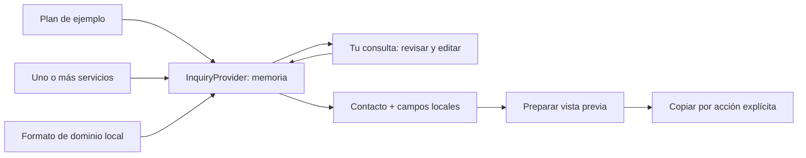

# P3.4 — Interacciones locales

P3.3 fue aprobada como base técnica y composición general, no como aprobación visual final. Alcance: interacciones locales del piloto y de la configuración sintética. P3.5 y P4–P7 no iniciadas. No se genera nexonova-website ni se modifica nexonova-prototype.

## Componentes y estado

InquiryProvider conserva únicamente en memoria { planId, services, domain }. Los botones de planes/servicios, DomainSearch, Inquiry y ContactForm consumen ese contexto. El contenido sigue llegando como props desde JSON público; no hay condiciones por nombre de cliente, imports Python, dependencias file: ni metadata privada.



Plan único reemplazable; servicios múltiples sin duplicados; un dominio editable/eliminable. No se calculan totales ni se crea pedido, reserva, pago o contratación. El resumen pasa a Contacto junto con nombre, medio de contacto, interés libre y mensaje. Se requieren campos no vacíos y límites de longitud. El medio se trata como texto, no se verifica que exista correo/teléfono ni se inventa un destino.

prepareInquiry produce texto plano, escapado por React al mostrarlo. La vista previa se vincula al contenido exacto de campos/selección; cualquier cambio la invalida para impedir copiar un resumen anterior. El aviso literal es «La consulta se ha preparado; no se ha enviado.». Clipboard API solo escribe tras pulsar Copiar; si el navegador lo deniega se muestra un aviso y se selecciona el texto para copia manual. El portapapeles es la única salida explícita del usuario; no se afirma que el sistema operativo borre lo copiado al recargar.

## Dominios

normalizeDomain: trim, minúsculas, retiro de prefijo http(s), barra final y punto DNS final. Conserva www/subdominios porque no se consulta DNS ni se asume equivalencia. Acepta etiquetas ASCII o punycode con límites DNS, rechaza IP, rutas, query, credenciales, etiquetas vacías, guiones extremos y Unicode sin convertir. IDN Unicode, sufijos públicos y existencia real quedan fuera de esta validación sintáctica.

Avisos explícitos: «Demostración: no consulta disponibilidad ni registra dominios.» y «Disponibilidad no consultada». No aleatoriedad, fetch, WHOIS ni /api/domains/check. Un resultado válido puede añadirse a la selección; modificar el texto de búsqueda invalida ese resultado hasta validarlo otra vez.

## Asistente

ChatService define reply(message): Promise<string>; createLocalChat implementa respuestas deterministas desde servicios, planes, FAQ exacta y límites de contacto. behavior separa avisos, límite de historial y fallback de la UI. Preguntas no contempladas reciben una explicación de límites, no afirmaciones nuevas. No se interpreta HTML ni se ejecutan instrucciones recibidas.

DemoChat recibe opcionalmente un servicio compatible: la UI no necesita reescribirse para un proveedor futuro, cuya autorización y controles de privacidad/red no están implementados ni implícitamente aprobados. Historial en memoria, máximo 40 mensajes. Entrada limitada a 500 caracteres. No se envían nombre, contacto ni selección al servicio de chat.

Launcher flotante y dialog modal con título, mensaje de límites, historial y accesos a secciones. Planes de ejemplo solo aparece si esa configuración tiene planes; la sintética informa por chat que no hay planes. Apertura enfoca el campo; Tab/Shift+Tab permanecen dentro; Escape/cerrar devuelven foco al launcher. Los accesos cierran y enfocan la sección elegida. Navegación no modifica la selección.

## Seguridad y diferencias respecto de P3.3/prototipo

- Sin endpoints, SDK, credenciales, persistencia ni solicitudes de negocio. Estado desaparece al recargar. No localStorage/sessionStorage.
- Formularios React con preventDefault; CSP form-action none bloquea envío nativo incluso sin JavaScript. No backend ni Server Actions.
- Header/hero, colores, tarjetas y FAQ se conservan. Se habilita validación local del panel de dominios.
- Tu consulta pasa antes de Contacto para seguir el recorrido. El antiguo panel DemoPanels sin consumidores se elimina; ahora existen componentes separados conectados por estado.
- Contacto es formulario visible y vista previa, no modal de envío/CAPTCHA del prototipo. Datos comerciales siguen provisionales.
- Chat recupera launcher/panel flotante, colores de marca y disposición de mensajes. Se usa modal nativo y foco cíclico explícito en lugar del widget JS histórico. No Gemini ni animaciones externas.
- Sin nuevos assets, fuentes o dependencias npm. Permanecen las omisiones/Inter fallback aprobados en P3.3. No se afirma fidelidad visual final.

## Inventario

Creados en templates/corporate-site: src/services/interactions.ts; componentes InquiryState, DomainSearch, SelectionButtons, Inquiry, ContactForm y DemoChat; tests/browser/services.spec.ts e interactions.spec.ts.

Modificados: CorporateSite, Sections, Site.module.css, next.config.ts (CSP), tests/browser/visual.spec.ts y README. Eliminado: src/components/DemoPanels.tsx, después de sustituir su único import. Sin movimientos. Los contratos/schemas P3.2, runtime/tests P2 y lockfile no se modifican.

Los checks P3.3 de controles desactivados/cero formularios se sustituyen por expectativas de interacción habilitada/formularios sin action; es el cambio funcional autorizado. Permanecen anclas, responsive, teclado FAQ, errores JS, reduced-motion y límites externos. No se convierte un fallo de seguridad en un éxito relajando una aserción.

## Pruebas y evidencia

Copias de validación independientes en /var/tmp/nexonova-p34-validation/{synthetic,nexonova}, con sustitución explícita solo del JSON público del piloto. No es un generador ni un repositorio de producto aceptado. Instalación preparatoria con HOME temporal, userconfig=/dev/null, sin scripts de dependencias ni credenciales. Navegador headless ya preparado en P3.3, no se descargan herramientas nuevas. Servidor solo 127.0.0.1:3183 y se detiene al finalizar.

```sh
npm ci --ignore-scripts --no-audit --no-fund
npm run typecheck
npm test
NEXT_TELEMETRY_DISABLED=1 npm run build
NEXT_TELEMETRY_DISABLED=1 PLAYWRIGHT_BROWSERS_PATH=/var/tmp/nexonova-p33-browsers npm run test:browser
```

El executor P2 sigue siendo de Python. Estos son comandos de validación manual autorizada del código nuevo, no una certificación de adaptador Node restringido. Ese adaptador y la generación permanecen para sus etapas aprobadas posteriores.

Primer intento: typecheck/build y 20 pruebas pasaron, 2 fallaron porque Tab podía salir del diálogo. Corrección: ciclo explícito de Tab/Shift+Tab; las aserciones originales se conservan. Evidencia preservada en [P3_4_VALIDATION_INITIAL.json](P3_4_VALIDATION_INITIAL.json).

Suite completa de fábrica, prototipo, imports y CLI: [P3_4_FACTORY_VALIDATION.json](P3_4_FACTORY_VALIDATION.json). La ejecución Docker actualiza su registro habitual; no se cambian restricciones P2.

## Límites y revisión humana

Pendiente: aprobación visual final, revisión integral WCAG/contraste y otros navegadores, derechos/publicación y material omitido. La validación de dominio solo acredita sintaxis ASCII, el chat no entiende lenguaje general, no verifica ofertas y su historial es efímero. La copia puede depender de permisos del navegador; existe fallback explícito.

El generador, manifests de producto y cualquier integración externa no se implementan en P3.4. P3.5 permanece detenido para revisión humana.

## Corrección de funcionamiento sin JavaScript

La prueba añadida de CSP detectó una transición no completada del navegador al intentar submit sin JavaScript (22 pruebas aprobadas, 1 timeout). No se atribuye éxito a ese intento: [P3_4_VALIDATION_NOJS_INITIAL.json](P3_4_VALIDATION_NOJS_INITIAL.json).

Se mantienen form-action none y preventDefault, y se añade ready en InquiryProvider: los botones de los formularios de dominio permanecen disabled hasta la hidratación. Contacto ya inicia con submit desactivado por campos vacíos. Se muestra noscript explicando el límite. La prueba verifica el header CSP, el botón desactivado y un Enter real sin navegación ni solicitudes. El comportamiento sin JavaScript es deliberadamente no interactivo, nunca envío por fallback.

## Revisión de capturas

La inspección de la captura móvil detectó que las respuestas largas podían quedar debajo del área visible del historial. Se añadió scroll al último mensaje al actualizar el historial y una aserción toBeInViewport sobre la respuesta de límites. Se añadió Shift+Tab real además del recorrido Tab. No se modificaron expectativas anteriores para ocultar fallos. La validación anterior al ajuste se conserva en P3_4_VALIDATION_BEFORE_SCROLL.json.

## Cierre y evidencia final

Ambas configuraciones pasan instalación reproducible, typecheck y build. Cada una aprueba 23 pruebas Playwright: 16 casos de lógica y 7 de navegador. Total: **32 pruebas de lógica, 14 de navegador y 4 pruebas Node de contenido**, sin skips/retries/xfails. La suite Python completa conserva **136 aprobadas**, incluidas las pruebas Docker P2. Los fallos previos permanecen registrados.

Comandos y salidas completas: [P3_4_VALIDATION.json](P3_4_VALIDATION.json). Comprobaciones de cierre y hashes: [P3_4_FINAL_CHECKS.json](P3_4_FINAL_CHECKS.json).

Capturas del piloto con datos sintéticos:

- [Flujo de escritorio](p3-4-evidence/nexonova/flow-1440.png) y [flujo móvil](p3-4-evidence/nexonova/flow-390.png).
- [Chat escritorio](p3-4-evidence/nexonova/chat-1440.png) y [chat móvil](p3-4-evidence/nexonova/chat-390.png).
- También se conservan landing a 1440/390/320px y las capturas correspondientes a la configuración sintética.

Las capturas de chat escritorio/móvil fueron inspeccionadas después de corregir el desplazamiento; muestran la respuesta actual y el foco visible. No se afirma comparación pixel-perfect, auditoría WCAG completa ni pruebas en otros navegadores.

P3.4 queda implementada y validada para revisión humana. P3.5 permanece NO INICIADA. Los proveedores futuros requerirán políticas, permisos, privacidad, cancelación y timeouts propios; la interfaz sustituible no los implementa ni los autoriza. Se conservan todos los límites de material/procedencia aceptados anteriormente.

Documentación de arquitectura actualizada en docs/architecture.md para reflejar el estado compartido y las fronteras del runtime web. La validación final confirmó cero contenedores nexonova-test- y ningún listener en el puerto de prueba 3183.
